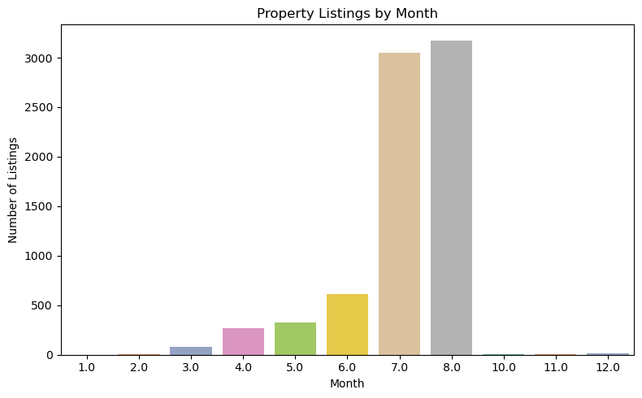

# Mumbai Real Estate Market Analysis

## Project Overview
This project conducts comprehensive exploratory data analysis (EDA) of Mumbai's real estate market, analyzing property pricing patterns, identifying key pricing factors, and building a simple predictive model for price estimation. The analysis reveals insights into how property characteristics like size, location, age, and type influence prices in one of India's most dynamic real estate markets.

## Dataset
The analysis uses Mumbai property data containing information about:
- Property prices (per square foot)
- Property area measurements
- Bedroom counts
- Property types
- Property age
- Location information
- Registration dates

## Key Features
- **Data cleaning and preprocessing** of Mumbai real estate dataset
- **Outlier detection and removal** using IQR method
- **Comprehensive data visualization** with 9 different analysis plots
- **Statistical analysis** of property pricing factors
- **Price prediction model** using linear regression

## Analysis Highlights

### 1. Price Distribution Analysis

- Histogram visualization of price per square foot after outlier removal
- Statistical description of central tendency and spread in pricing

### 2. Property Characteristic Relationships

- Analysis of bedroom count vs. price per square foot
- Evaluation of property area impact on unit pricing
- Investigation of property age influence on valuation

### 3. Geographic Price Variation

- Comparison of average property prices across Mumbai areas
- Identification of premium and budget-friendly localities

### 4. Property Type Analysis

- Distribution of property types in the market
- Identification of premium property categories by average price

### 5. Correlation Analysis

- Heatmap visualization of relationships between numerical features
- Identification of key price determinants

### 6. Temporal Patterns

- Analysis of property listings by registration month
- Identification of seasonal trends in the market

### 7. Area vs Price Relationship

- Scatter plot showing relationship between property size and price
- Analysis of price variation across different property sizes

### 8. Premium Property Types

- Bar plot of property types with highest average prices
- Analysis of luxury segments in the real estate market

### 9. Property Age Analysis

- Line chart showing how property age affects pricing
- Trends in valuation based on building age

### 10. Predictive Modeling

- Simple linear regression model for price prediction
- Model evaluation using Mean Squared Error

## Technologies Used
- **Python 3.x**
- **Pandas** for data manipulation
- **Matplotlib** and **Seaborn** for data visualization
- **Scikit-learn** for machine learning implementation

## Installation and Usage

1. Clone the repository:
```bash
git clone https://github.com/Adityaraj86
cd mumbai-real-estate-analysis
